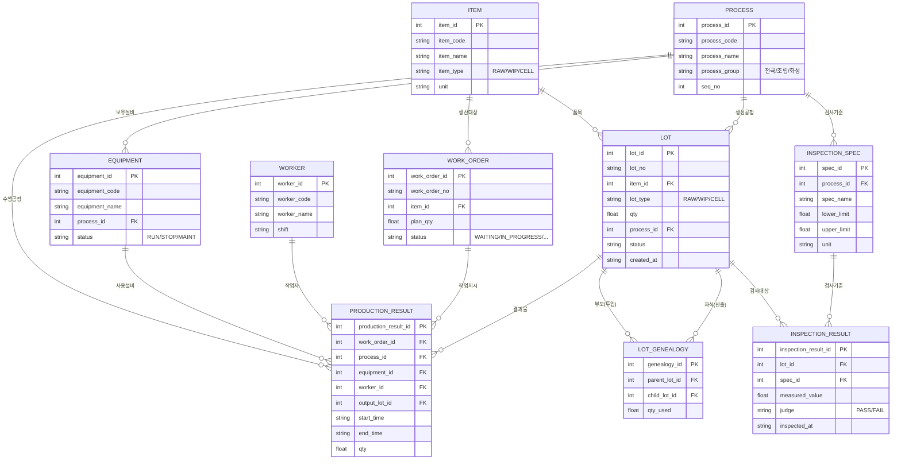

# 🔋 Battery Cell MES — 배터리 셀 제조 미니 MES

파우치형 리튬이온 배터리 셀(EV용) 제조 공정을 대상으로 만든 미니 MES(Manufacturing
Execution System)이다. 원자재 입고부터 극판·조립·화성 3개 공정군(총 12단계)을 거쳐
완제품 셀이 만들어지기까지의 전체 흐름을, 계보 추적과 품질관리 기능까지 포함해서
Streamlit + SQLite로 구현했다.

> AI 스마트제조 융합인재 양성과정 실습 프로젝트

---

## 목차

- [프로젝트 소개](#프로젝트-소개)
- [주요 기능](#주요-기능)
- [기술 스택](#기술-스택)
- [설치 및 실행](#설치-및-실행)
- [프로젝트 구조](#프로젝트-구조)
- [데이터베이스 설계](#데이터베이스-설계)
- [배터리 셀 제조 공정 흐름](#배터리-셀-제조-공정-흐름)
- [페이지별 설명](#페이지별-설명)
- [설계에서 신경 쓴 부분](#설계에서-신경-쓴-부분)
- [알려진 한계와 향후 개선 방향](#알려진-한계와-향후-개선-방향)
- [개발 과정](#개발-과정)

---

## 프로젝트 소개

### 주제 선정 이유

과정 중 강사님이 만든 라면공장 예제 MES(MiniMes)를 실습으로 다뤘다. 이 구조를
그대로 따라 하는 대신, 개인적으로 관심 있던 **2차전지(배터리) 제조 공정에 같은
MES 설계 원리를 적용해보면 어떨까** 하는 생각으로 이 프로젝트를 시작했다.

라면공장 예제는 단일 공정(포장) 수준이었다면, 배터리 셀 제조는 **12단계 공정을
거치면서 여러 원자재가 하나로 합쳐지거나(N:1) 하나가 여러 결과물로 나뉘는(1:N)
계보 관계**가 실제로 존재한다. 이런 복잡도가 있는 도메인을 다뤄보면 MES의 핵심
개념(추적성, 계보관리, 품질관리)을 더 제대로 체감할 수 있겠다고 판단했다.

**참고한 자료:**
- 강사님 제공 라면공장 MiniMes 예제 — 페이지 구성, 테이블 설계 패턴의 출발점
- 배터리 제조 공정 관련 자료 — 각 공정 단계의 순서와 역할 조사


### MES(Manufacturing Execution System)란

MES는 "지금 공장에서 무슨 일이 일어나고 있는지"를 실시간으로 기록하고 보여주는
시스템이다. ERP가 "이번 달에 뭘 만들 계획인지"를 다룬다면, MES는 "그 계획대로
지금 어디까지 진행됐는지, 누가 언제 어떤 설비로 만들었는지, 품질은 기준을
통과했는지"를 다룬다.

이 프로젝트는 MES의 핵심 기능 중 아래 4가지를 미니 규모로 구현했다.

| 기능 | 이 프로젝트에서의 구현 |
|---|---|
| 생산계획 | 작업지시(work order)를 등록하고 계획수량 대비 달성률을 추적 |
| 생산실적 관리 | 각 공정 페이지에서 투입재료 → 결과물을 등록하면 LOT·계보·실적이 자동 기록됨 |
| 추적성(traceability) | `lot_genealogy` 테이블 + 재귀 쿼리로 원자재부터 완제품까지 역방향/정방향 추적 |
| 품질관리 | 측정값을 기준치(`inspection_spec`)와 비교해 PASS/FAIL 자동 판정 |

---

## 주요 기능

- **실시간 대시보드** — 설비가동률, 작업지시 달성률, 공정 진행 파이프라인(시간 기반 실시간 상태), 공정별 불량률
- **작업지시 관리** — 새 작업지시 등록, 전체 작업지시 진행 현황 조회
- **원재료 입고** — 원자재 LOT 등록, 품목별 잔여재고 시각화
- **공정 실적 등록 (극판/조립/화성)** — 공정별로 투입 가능한 재료만 자동 필터링, 결과수량 자동계산, LOT번호 자동생성
- **품질검사** — 화성공정에서 측정값 입력 시 기준치 대비 PASS/FAIL 자동 판정
- **셀 시리얼 추적** — 특정 LOT을 골라 원료(역방향) 또는 영향범위(정방향)를 재귀적으로 추적, 검사이력 함께 조회

---

## 기술 스택

| 분류 | 사용 기술 |
|---|---|
| 언어 | Python 3.14 |
| 웹 프레임워크 | Streamlit |
| 데이터베이스 | SQLite |
| 데이터 처리 | pandas |
| 버전관리 | Git / GitHub |

---

## 설치 및 실행

```bash
# 1. 저장소 클론
git clone https://github.com/kyc4039/Mini_MES.git
cd Mini_MES

# 2. 의존성 설치
pip install -r requirements.txt

# 3. 데이터베이스 생성 (스키마 + 덤프 데이터 반영)
sqlite3 sql/mes_final.db < sql/dump.sql

# 4. 앱 실행
streamlit run main.py
```

브라우저에서 `http://localhost:8501`로 접속하면 대시보드가 뜬다.

---

## 프로젝트 구조

```
mes_final/
├── README.md
├── requirements.txt
├── main.py                      ← 진입점 (네비게이션 정의만 담당)
├── .streamlit/
│   └── config.toml               ← 라이트 테마 설정
├── docs/
│   ├── schema.md                  ← ERD + 테이블별 설계 의도
│   ├── domain.md                  ← 배터리 제조 공정 도메인 지식 정리
│   ├── decisions.md                ← 설계 트레이드오프 기록
│   ├── journal.md                  ← 개발 일지 (겪은 문제와 해결 과정)
│   └── images/                     ← README용 스크린샷
├── pages/
│   ├── 대시보드.py
│   ├── 작업지시_관리.py
│   ├── 원재료_입고.py
│   ├── 극판공정_실적.py
│   ├── 조립공정_실적.py
│   ├── 화성공정_실적.py
│   └── 셀_시리얼_추적.py
├── src/
│   ├── db.py                       ← DB 커넥션
│   ├── queries.py                  ← 조회 전용 쿼리 모음
│   ├── services.py                 ← 등록/저장 로직 (트랜잭션 처리)
│   └── process_rules.py            ← 12개 공정의 투입/산출/직전공정 규칙
└── sql/
    └── dump.sql                     ← 스키마 + 샘플데이터 덤프
```

---

## 데이터베이스 설계

10개 테이블을 **마스터 데이터**(변하지 않는 기준정보)와 **트랜잭션 데이터**(매번
새로 쌓이는 실적)로 나눠 설계했다.

### 마스터 데이터
| 테이블 | 역할 |
|---|---|
| `item` | 품목(원자재/재공품/완제품) |
| `process` | 공정(12단계, 전극/조립/화성 그룹) |
| `equipment` | 설비(공정별 1~2대) |
| `worker` | 작업자 |
| `inspection_spec` | 공정별 검사기준(상한/하한값) |

### 트랜잭션 데이터
| 테이블 | 역할 |
|---|---|
| `work_order` | 작업지시(무엇을 얼마나 만들지) |
| `lot` | 원자재 입고부터 완제품까지, 모든 실물 단위를 관리하는 핵심 테이블 |
| `lot_genealogy` | LOT 간의 부모-자식 관계(계보). 이 테이블 하나로 N:1, 1:N, 1:1 관계를 전부 표현 |
| `production_result` | 실제 생산실적(언제, 어느 설비, 누가, 얼마나) |
| `inspection_result` | 검사 측정값과 PASS/FAIL 결과 |

### ERD



`LOT_GENEALOGY`가 `LOT`이랑 두 번 연결된 게 핵심이다 — 하나는 "부모(투입)",
하나는 "자식(산출)"인데, 이게 바로 셀 시리얼 추적 페이지가 재귀적으로 타고
올라가는 그 관계다.

자세한 설계 의도는 [`docs/schema.md`](docs/schema.md) 참고.

---

## 배터리 셀 제조 공정 흐름

파우치형 리튬이온 배터리 셀(EV용) 기준으로 12단계를 구현했다.

```
[전극 공정]
믹싱 → 코팅 → 프레스 → 슬리팅
활물질+바인더를    슬러리를 알루미늄박에    압연해서 두께를    설계폭에 맞춰
섞어 슬러리 제조    코팅해 코팅롤 제조      줄이고 밀도 확보    세로로 절단

[조립 공정]
노칭 → 스태킹 → 파우치 실링 → 전해액 주입
시트를 정해진 크기로   양극판+분리막을       파우치를 밀봉        전해액을 주입
타발(찍어냄)          겹쳐 셀 탄생(CELL)    (여기부터 셀 하나가 끝까지 이어짐)

[화성 공정]
에이징 → 화성 충방전 → 디개싱 → 최종검사
전해액이 전극에      최초 충방전으로       충방전 중 발생한     전압·용량 등
충분히 스며들도록    셀을 활성화           가스를 제거          최종 품질 확인
숙성
```

**핵심 포인트 — 언제 LOT이 새로 생기고, 언제 원자재가 다시 투입되는지:**
- 믹싱·코팅·스태킹은 **원자재가 새로 투입되는(N:1) 지점**이다. 나머지 공정은
  이미 있는 것을 가공만 한다(1:1).
- **스태킹에서 처음으로 "셀"(완제품 단위)이 탄생**한다. 그 이전(전극 공정)까지는
  재공품(WIP) 단위로 관리된다.
- 스태킹 이후(실링~최종검사)는 **같은 물리적 셀이 공정을 거칠 때마다 새 LOT
  번호를 받으며 이어진다.** 이게 `lot_genealogy`에서 부모-자식이 1:1로 계속
  연결되는 구간이다.

자세한 도메인 지식은 [`docs/domain.md`](docs/domain.md) 참고.

---

## 페이지별 설명

| 페이지 | 설명 |
|---|---|
| **대시보드** | 설비가동률·검사합격률·작업지시달성률 KPI, 시간 기반 실시간 공정 파이프라인, 공정별 불량률 |
| **작업지시 관리** | 작업지시 신규 등록(번호 자동생성), 전체 작업지시 진행 현황 조회 |
| **원재료 입고** | 원자재 LOT 등록(번호·입고시각 자동생성), 품목별 잔여재고 막대 |
| **극판공정 실적** | 믹싱→코팅→프레스→슬리팅. 공정 선택 시 투입 가능 재료 자동 필터링, 결과수량 자동계산 |
| **조립공정 실적** | 노칭→스태킹→실링→전해액주입. 스태킹에서 CELL이 처음 탄생 |
| **화성공정 실적** | 에이징→화성충방전→디개싱→최종검사. 생산실적 등록 + 검사결과 자동판정 |
| **셀 시리얼 추적** | LOT 검색 → 역방향(원료 추적)/정방향(영향범위 추적), 검사이력 함께 조회 |

---

## 설계에서 신경 쓴 부분

- **트랜잭션 원자성** — 생산실적 등록 시 "결과 LOT 생성 → 계보 기록 → 실적
  기록 → 투입 LOT 소진처리"가 하나의 트랜잭션으로 묶여있다. 중간에 실패하면
  전부 롤백돼서 데이터가 반쪽만 저장되는 일이 없다.
- **재고 초과 투입 방지** — 저장 전에 각 투입 LOT의 실제 잔여수량을 먼저
  확인해서, 남은 양보다 많이 투입하려는 시도를 막는다.
- **공정 순서 검증** — 단순히 "품목 카테고리가 맞으면" 투입 가능한 게 아니라,
  "정확히 바로 직전 공정에서 나온 LOT만" 인정하도록 제약을 걸었다. 여러
  작업지시·여러 날짜의 데이터가 쌓여도 엉뚱한 단계의 결과물이 섞이지 않는다.
- **규칙의 중앙화** — 12개 공정의 투입/산출/소요시간/직전공정 규칙을
  `src/process_rules.py` 하나에 모아서, 극판·조립·화성 3개 페이지가 공유한다.
- **검사 자동판정** — 측정값을 하드코딩된 기준이 아니라 DB의 `inspection_spec`
  기준치와 비교해서 PASS/FAIL을 계산한다.
- **실시간 공정 파이프라인** — "몇 개 공정을 완료했는지" 세는 방식 대신, 각
  실적의 실제 시작~종료 시각과 현재 시각을 비교해서 대기/진행중/완료를 판정한다.

더 자세한 트레이드오프 기록은 [`docs/decisions.md`](docs/decisions.md) 참고.

---

## 알려진 한계와 향후 개선 방향

이 프로젝트는 미니 MES를 목표로 했기 때문에, 의도적으로 단순화하거나 아직
못 채운 부분들이 있다. 정직하게 남겨둔다.

- **BOM/라우팅 테이블 부재** — 공정별 투입/산출 규칙이 DB가 아니라 Python
  코드(`process_rules.py`)에 있다. 미니 프로젝트 규모에선 충분하지만, 규칙이
  더 복잡해지면 별도 테이블로 분리하는 게 정석이다.
- **동시성 고려 없음** — LOT ID 발급을 `MAX(id) + 1` 방식으로 하고 있어서,
  여러 사용자가 동시에 접근하는 환경에서는 경합 조건이 생길 수 있다.
  (단일 사용자 데모 목적으로는 문제없다.)
- **사용자 인증 없음** — 작업자는 드롭다운에서 선택할 뿐, 실제 로그인 계정과
  연결돼 있지 않다.
- **설비 정비이력/알람 로그 미구현** — MESA-11 모델 기준으로 자원배분,
  유지보수관리, 알람/이벤트 로그는 이번 범위에서 제외했다.
- **CSV 내보내기 등 리포트 기능 부재** — 현재는 화면 조회만 가능하다.

---

## 개발 과정

이 프로젝트를 만들면서 실제로 부딪혔던 문제들과, 그걸 어떻게 발견하고 고쳤는지를
[`docs/journal.md`](docs/journal.md)에 시간 순서대로 정리해뒀다. "처음부터
완벽하게 설계했다"보다 "문제를 어떻게 찾아내고 왜 그렇게 고쳤는지"를 남기는 게
더 의미 있다고 생각해서 따로 기록했다.