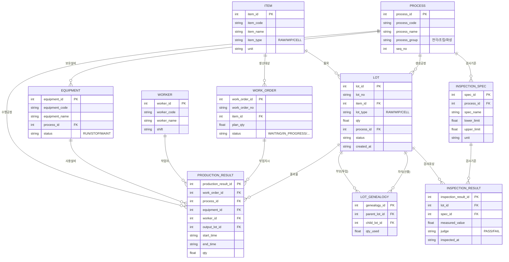

```mermaid
erDiagram
    ITEM ||--o{ LOT : "품목"
    ITEM ||--o{ WORK_ORDER : "생산대상"
    PROCESS ||--o{ EQUIPMENT : "보유설비"
    PROCESS ||--o{ INSPECTION_SPEC : "검사기준"
    PROCESS ||--o{ LOT : "생성공정"
    PROCESS ||--o{ PRODUCTION_RESULT : "수행공정"
    EQUIPMENT ||--o{ PRODUCTION_RESULT : "사용설비"
    WORKER ||--o{ PRODUCTION_RESULT : "작업자"
    WORK_ORDER ||--o{ PRODUCTION_RESULT : "작업지시"
    LOT ||--o{ PRODUCTION_RESULT : "결과물"
    LOT ||--o{ LOT_GENEALOGY : "부모(투입)"
    LOT ||--o{ LOT_GENEALOGY : "자식(산출)"
    LOT ||--o{ INSPECTION_RESULT : "검사대상"
    INSPECTION_SPEC ||--o{ INSPECTION_RESULT : "검사기준"

    ITEM {
        int item_id PK
        string item_code
        string item_name
        string item_type "RAW/WIP/CELL"
        string unit
    }
    PROCESS {
        int process_id PK
        string process_code
        string process_name
        string process_group "전극/조립/화성"
        int seq_no
    }
    EQUIPMENT {
        int equipment_id PK
        string equipment_code
        string equipment_name
        int process_id FK
        string status "RUN/STOP/MAINT"
    }
    WORKER {
        int worker_id PK
        string worker_code
        string worker_name
        string shift
    }
    INSPECTION_SPEC {
        int spec_id PK
        int process_id FK
        string spec_name
        float lower_limit
        float upper_limit
        string unit
    }
    WORK_ORDER {
        int work_order_id PK
        string work_order_no
        int item_id FK
        float plan_qty
        string status "WAITING/IN_PROGRESS/..."
    }
    LOT {
        int lot_id PK
        string lot_no
        int item_id FK
        string lot_type "RAW/WIP/CELL"
        float qty
        int process_id FK
        string status
        string created_at
    }
    LOT_GENEALOGY {
        int genealogy_id PK
        int parent_lot_id FK
        int child_lot_id FK
        float qty_used
    }
    PRODUCTION_RESULT {
        int production_result_id PK
        int work_order_id FK
        int process_id FK
        int equipment_id FK
        int worker_id FK
        int output_lot_id FK
        string start_time
        string end_time
        float qty
    }
    INSPECTION_RESULT {
        int inspection_result_id PK
        int lot_id FK
        int spec_id FK
        float measured_value
        string judge "PASS/FAIL"
        string inspected_at
    }
```